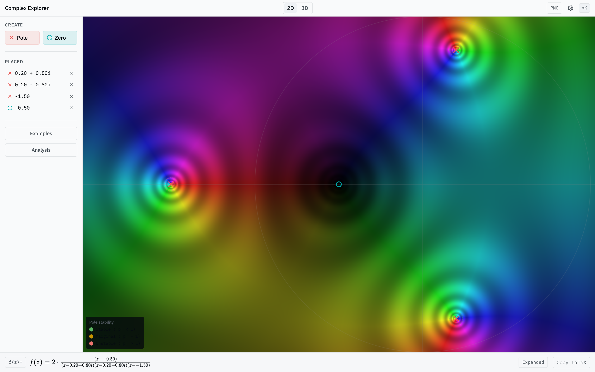

# Complex Explorer

An interactive web-based complex function explorer — "Desmos for complex analysis." Drag poles and zeros onto the complex plane and watch a GPU-accelerated domain coloring reveal how the function's structure shapes its behavior. Toggle a 3D magnitude surface for the same function as an analytic landscape.



▸ **Live demo:** [plot.catrgb.com](https://plot.catrgb.com/)

---

## What it does

Complex Explorer is an educational tool for students learning complex analysis. It maps a complex-valued function `f(z)` to colors so the structure of the function becomes visible at a glance:

- **Hue** encodes the phase `arg(f(z))` — red for positive real, yellow-green for positive imaginary, cyan for negative real, blue-violet for negative imaginary.
- **Lightness** encodes the modulus `|f(z)|` — black at zeros, white at poles, with the smooth `ℓ(r) = (2/π)·arctan(r)` mapping for inverse-function symmetry.
- **Enhanced contours** (modulus rings, phase lines, grid) layer on top so conformality becomes readable as the shape of the tiling.

The screenshot above shows `f(z) = 2 · (z − (−0.5)) / ((z − (0.2 + 0.8i))(z − (0.2 − 0.8i))(z − (−1.5)))` — three poles and one zero, with the characteristic counterclockwise color cycling around the zero and clockwise cycling around each pole.

---

## Features

### Interaction

- **Drag poles (×) and zeros (○)** from the toolbox onto the complex plane to place them.
- **Drag placed singularities** to reposition them. Conjugate pairs move together and merge onto the real axis when `Im ≈ 0`.
- **Click + Delete/Backspace** to remove a selected singularity.
- **Mouse-wheel zoom** centered on the cursor; click-drag to pan; pinch-to-zoom on touch.
- **Cmd+K command palette** for reset, clear, contour toggles, view switch, and preset functions.
- **Pole stability readout** in the canvas — stable (|p| < 1, green), marginal (|p| = 1, amber), unstable (|p| > 1, red).

### Live formula

The formula bar at the bottom of the screen renders `f(z)` in factored form via KaTeX and updates on every drag frame. A toggle swaps to the expanded polynomial form, and a **Copy LaTeX** button puts the source on the clipboard.

### Coordinate readout

`z = X.XX + Y.YYi` follows the cursor in monospace, with `f(z)`, `|f(z)|`, and `arg(f(z))` displayed alongside.

### 2D ↔ 3D view toggle

- **2D** — full WebGL2 domain coloring (default).
- **3D** — `|f(z)|` rendered as a height field colored by `arg(f(z))` via react-three-fiber, with orbit camera controls.

### Sharing

The current function, view center, and zoom level are encoded into the URL hash. Anyone opening the link sees the same configuration — useful for assignments and walkthroughs.

### Export

A PNG button captures the current canvas at print-friendly resolution.

---

## Documentation

- **[Build specification](docs/plans/complex-explorer-prompt.md)** — complete spec covering product vision, tech stack, architecture, domain coloring theory, 3D surface, interaction design, formula system, state management, performance budget, accessibility, and a phased implementation plan.
- **[Architecture research](docs/plans/compass_artifact_wf-c9900c2e-6d90-47ba-9da1-a5265ad12430_text_markdown.md)** — the technical research backing the build choices (WebGL2 vs WebGPU, domain coloring math, drag-and-drop patterns, the recommended library stack, and 60fps architecture on student Chromebooks).

---

## Tech stack

| Layer | Technology |
|-------|-----------|
| Build | Vite 7, Vike (SPA mode) |
| UI framework | React 19 + TypeScript 5.9 |
| 2D domain coloring | Raw WebGL2 fragment shaders (single fullscreen quad) |
| 3D magnitude surface | react-three-fiber v9 + Three.js |
| Styling | Tailwind CSS 4, shadcn/ui + Radix |
| State | Zustand v5 (readable outside React via `getState()`) |
| Math rendering | KaTeX (synchronous, 60fps-viable) |
| Expression parsing | math.js (AST access + `toTex()`) |
| Drag / gesture | @use-gesture/react |
| 2D pan/zoom | d3-zoom |
| Icons | Lucide React |
| Toasts | Sonner |
| Command palette | cmdk |
| Quality | Biome (format + lint), jscpd (duplication) |
| Tests | Vitest + React Testing Library, Playwright (e2e) |

### Why WebGL2 and not WebGPU

Domain coloring is a single-draw-call, fragment-shader-bound workload — both APIs dispatch to the same GPU ALUs, so performance is identical here. WebGL2 covers **95.6%** of browsers vs WebGPU's **82.7%**, which matters for an educational tool used on older iPads, Linux lab machines, and school-managed Chromebooks.

### Why uniform arrays for poles and zeros

Dragging a pole never recompiles the shader — it calls `gl.uniform2fv()` once per frame. The fragment shader evaluates the rational function with a loop over a `vec2[]` uniform array and a count uniform. Only switching to an entirely different function form (e.g., rational → exponential) triggers recompilation.

---

## Quick start

```bash
# Install
npm install

# Dev server
npm run dev

# Build
npm run build

# Preview production build
npm run preview

# Tests
npm test          # unit
npm run test:e2e  # Playwright

# Quality gates
npm run lint
npm run format
```

The dev server boots the app at the configured local port; the production build is what [plot.catrgb.com](https://plot.catrgb.com/) serves.

---

## Repository layout

```
docs/
├── screenshot.png                       # Live demo screenshot
└── plans/
    ├── complex-explorer-prompt.md       # Full build specification
    └── compass_artifact_wf-…md          # Architecture & research
```

The implementation lives in source files alongside this directory. The plans in `docs/plans/` are the canonical reference for product intent, architectural decisions, and the math.

---

## License

MIT
